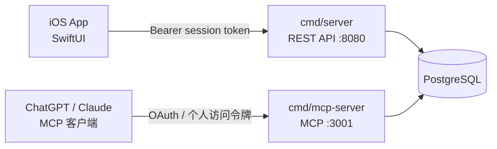

# Cardly 后端文档

写给接手这套后端的人（包括几个月后的自己）。这里不只记录「是什么」，也记录**「为什么这么做」和「哪里有坑」**——前者读代码能得到，后者不能。

根目录的 [`README.md`](../README.md) 是快速上手与环境变量清单；本目录是深入内容。

| 文档 | 内容 |
|---|---|
| [architecture.md](architecture.md) | 进程与依赖、当前数据模型、删除语义、schema 管理、复习算法、卡片方向与分词 |
| [auth.md](auth.md) | 身份模型、两种登录方式、验证码、密码、会话、鉴权中间件、密钥配置 |
| [api.md](api.md) | 33 个 REST 端点的完整参考 |
| [mcp.md](mcp.md) | MCP 三个工具、两条鉴权路径、OAuth 流程、会话绑定 |

## 系统全貌



两个进程**共享 `internal/` 下的全部代码**（`auth`、`db`、`model`、`service`、`scheduler`），也共享同一个数据库。

它们还必须共享同一个 `AUTH_TOKEN_SECRET`：会话令牌、验证码、MCP 个人访问令牌全部用它做 HMAC，两边不一致时，一个进程签发的凭据在另一个进程会直接失效，而且**报错是无线索的 401**。

## 领域概念

| 代码里 | 对外（API 文案 / iOS / MCP） | 说明 |
|---|---|---|
| `subject` | Subject | 学习科目，如 English |
| `set` | Set | 科目下的分组 |
| `card` | Card | 一张闪卡，正面提示 + 背面答案 + 语法短语 |
| `identity` | — | 一种登录方式（邮箱 / 手机号 / 第三方），内部概念，不直接对外 |

## 5 分钟跑起来

```bash
docker compose up -d postgres

cd backend
AUTH_TOKEN_SECRET=dev-secret AUTH_DEV_CODE_LOG=true PORT=8081 go run ./cmd/server
```

`AUTH_DEV_CODE_LOG=true` 会把验证码打进服务端日志，本地开发不需要能发邮件。登录时从日志里取码：

```bash
curl -s -X POST http://127.0.0.1:8081/api/auth/request-code \
  -H 'Content-Type: application/json' -d '{"email":"you@example.com"}'
# 日志里出现：auth verification code for email you@example.com (login): 123456
```

跑测试：

```bash
cd backend && go test ./...
```

需要 Postgres 的测试在数据库不可达时会自行 skip，所以没有 Docker 也能跑——但覆盖面会小很多。
