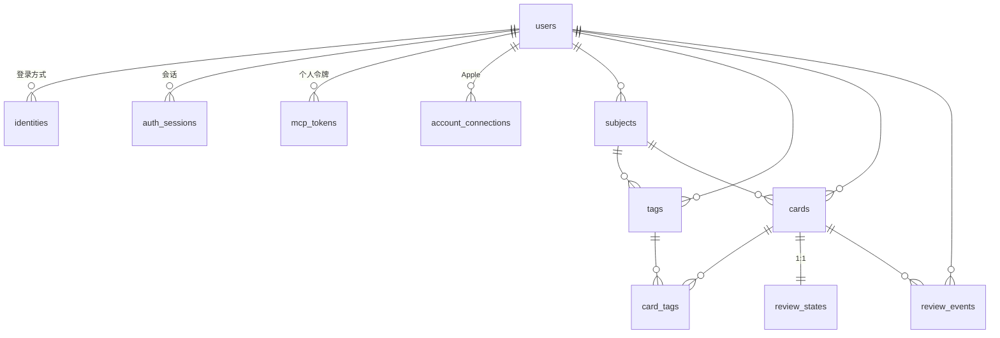

# 架构与数据模型

## 进程

| 程序 | 默认端口 | 职责 |
|---|---|---|
| `cmd/server` | 8080 | REST API，服务 iOS 客户端 |
| `cmd/mcp-server` | 3001 | MCP server，服务 ChatGPT 等 AI 客户端 |

两者共用 `internal/` 下所有包。差别只在入口：`cmd/server` 启动时会调 `EnsureDemoData` 灌 12 张演示卡，`cmd/mcp-server` 只调 `EnsureDemoUser`。

## 依赖

Go 1.23，**只有 5 个直接依赖**：

```
github.com/go-chi/chi/v5              路由与中间件
github.com/google/uuid                主键生成
github.com/jackc/pgx/v5               Postgres 驱动与连接池
github.com/modelcontextprotocol/go-sdk MCP 协议
golang.org/x/crypto                   bcrypt
```

依赖少是有意维持的。两个例子：

- **Resend 用标准库 `net/http` 调 REST API，没引 `resend-go` SDK**。`internal/auth/apple.go` 早就有直调第三方 JSON API 的先例（Apple 的 JWKS 与 token 端点），照着写省一个依赖。
- **OAuth 的 access token 是手写的两段式 HMAC 结构**，不是标准 JWT，因此不需要 JWT 库。代价是它不能被通用工具解析，见 [mcp.md](mcp.md#access-token-格式)。

## 数据模型



`auth_verification_codes` 与 `auth_provider_tokens` 不在图中：前者**完全没有外键**（按 identifier 字符串关联，因为发码时用户可能还不存在），后者只被 Apple 登录写入。

全部 DDL 在 `internal/db/db.go` 的 `migrationSQL` 常量里。

### 业务表

**subjects** — `id, user_id, name, created_at, updated_at, deleted_at`，`UNIQUE(user_id, name)`

**tags**（对外叫 Set）— `id, user_id, subject_id, name, ...`，`UNIQUE(user_id, subject_id, name)`。注意它**同时**带 `user_id` 和 `subject_id`，冗余但让归属校验能一条 SQL 完成。

**cards** — 除常规字段外：

| 列 | 说明 |
|---|---|
| `card_type` | `word` / `sentence`，默认 `sentence` |
| `direction` | `zh_to_en` / `en_to_zh`，默认 `zh_to_en`。**由后端推断，不接受客户端指定** |
| `grammar_phrases` | JSONB `[{"text":..,"note":..}]` |
| `answer_tokens` | JSONB `[{"text":..,"index":..}]`，写入时生成，见下文分词 |

**card_tags** — `PRIMARY KEY(card_id, tag_id)`。**唯一会被真正 DELETE 的表**：更新卡片标签时先全删再重插。

**review_states** — `card_id` 既是主键也是外键，与 cards 严格 1:1。

| 列 | 默认 | 说明 |
|---|---|---|
| `status` | `new` | `new` / `learning` / `review` / `mastered` / `deleted` |
| `ease` | `2.3` | REAL(float4)，读取时统一 `::float8` |
| `interval_days` | `0` | |
| `due_at` | `now()` | |
| `review_count` / `lapse_count` | `0` | |

**review_events** — 追加型事件表，记录每次复习。**只写不删，删账号也不清**。

### 认证表

见 [auth.md](auth.md) 的详细说明。这里只列结构要点：

| 表 | 关键约束 |
|---|---|
| `users` | `email` 可空（UNIQUE 保留）；`password_hash` 可空；`status` = `active`/`deleted` |
| `identities` | **`UNIQUE(type, value)`** — 邮箱去重的唯一执行点 |
| `auth_sessions` | `token_hash` UNIQUE，只存哈希 |
| `auth_verification_codes` | 无外键；`(identifier_type, identifier, purpose)` 三元组定位 |
| `mcp_tokens` | `token_hash` UNIQUE，只存哈希，**无过期时间** |
| `account_connections` | `UNIQUE(user_id, provider)` + `UNIQUE(provider, provider_user_id)`，目前只有 Apple 在用 |

## 五种「删除」语义

这是本项目最容易踩的地方——**同一个动词在不同表上是五件不同的事**：

| 方式 | 表 | 表现 |
|---|---|---|
| 软删 `deleted_at` | users, subjects, tags, cards | 所有查询都带 `deleted_at IS NULL` |
| 状态标记 | review_states | 无 `deleted_at` 列，改写 `status = 'deleted'` |
| 撤销 `revoked_at` | auth_sessions, mcp_tokens, auth_provider_tokens | 从不物理删除 |
| 消费 `consumed_at` | auth_verification_codes | 标记已用，**无清理任务** |
| 真删 `DELETE` | card_tags | 唯一一处 |
| **从不删除** | review_events, identities, account_connections | 连删账号都不清 |

### 级联链路

```
删 subject  → 软删该 subject 的 tags
            → 软删该 subject 的 cards
            → 对应 review_states 置 'deleted'
            （一个事务）

删 tag      → 软删挂该 tag 的 cards
            → 对应 review_states 置 'deleted'

删账号      → subjects / tags / cards 全部软删
            → review_states 置 'deleted'
            → sessions 与 provider tokens 撤销
            → users 置 deleted_at + status='deleted'
            （review_events 与 identities 保留）
```

⚠️ **删 tag 会连带删除挂在它下面的所有卡片**，即使那些卡片同时还挂在别的 tag 上。这是当前实现，不确定是否是产品本意。

⚠️ 软删账号后，**用同一邮箱再登录一次账号就会原地复活**（`FindOrCreateUser` 里 `deleted_at = NULL`），数据也还在。

## 迁移机制

单个 `migrationSQL` 字符串常量，启动时一次 `pool.Exec` 执行，全部语句用 `CREATE TABLE IF NOT EXISTS` / `ALTER TABLE ... ADD COLUMN IF NOT EXISTS` / `ON CONFLICT DO NOTHING` 保证幂等。

**没有版本号表，没有迁移历史。** 代价：

- 无法回滚
- 无法表达「先改数据再改结构」这类顺序依赖
- 数据回填语句（如 identities 的邮箱回填）会在每次启动时重跑，只能靠 `ON CONFLICT DO NOTHING` 兜住
- 破坏性变更（改列类型、删列）没有安全的写法

目前规模下够用，但**加破坏性变更前应该先引入真正的迁移工具**。

## 复习算法

`internal/scheduler/scheduler.go`，全文 90 行，纯函数无副作用。

### Apply

四档评分对状态的影响。所有分支都会 `review_count++` 并更新 `last_reviewed_at`：

| 评分 | status | interval_days | ease | due_at | lapse |
|---|---|---|---|---|---|
| `again` | learning | `0` | `max(1.3, ease − 0.2)` | +1 分钟 | +1 |
| `hard` | learning | `0` | `max(1.3, ease − 0.05)` | +6 分钟 | — |
| `good` | review | `max(3, round(interval × ease))` | `min(2.8, ease + 0.05)` | +interval 天 | — |
| `easy` | review | `max(4, round(max(1,interval) × (ease + 1.0)))` | `min(3.0, ease + 0.15)` | +interval 天 | — |

几个容易看漏的细节：

- **上界不对称**：下界统一 1.3；上界 good 是 **2.8**，easy 是 **3.0**。所以只按 good 复习的卡，ease 永远到不了 3.0。
- **计算 interval 用的是旧 ease**，新 ease 是另算的，两者互不影响。
- `again` / `hard` 把 `interval_days` 归零。所以答错后再答对，间隔从 3 天（good）或 4 天（easy）重新起步，而不是接着原来的间隔。
- `easy` 的 `max(1, interval)` 保证从 0 起步也能增长；`good` 没有这层保护，靠 `max(3, ...)` 兜底。
- 分钟级的 `again`/`hard` 用 `now.Add()`，天级的 `good`/`easy` 用 `now.AddDate(0,0,n)`——**后者是日历日加法**，会受时区与夏令时影响。handler 传入的是 UTC。
- 评分不在四者内时，`Apply` 返回**原始 state**（连 `review_count++` 都不生效）。API 层会先校验，所以走不到。

新卡（ease=2.3, interval=0）首次复习：

| 评分 | 下次 | 新 ease |
|---|---|---|
| again | 1 分钟后 | 2.1 |
| hard | 6 分钟后 | 2.25 |
| good | 3 天后 | 2.35 |
| easy | 4 天后 | 2.45 |

### Preview

对四个评分各跑一次 `Apply`（不落库），返回长度恒为 4、顺序恒为 `again, hard, good, easy` 的结果。这就是复习界面上四个按钮下方显示的间隔。

## 卡片方向与分词

`internal/service/tokenizer.go`。

### DetectDirection

```go
正面文本含任意一个汉字（unicode.Han） → zh_to_en
否则                                  → en_to_zh
```

规则就这一条，没有别的分支。

**方向由后端从正面文本推断，是唯一权威来源。** REST 与 MCP 两条写入路径都调这个函数，客户端传的 `direction` 一律被覆盖。这样杜绝了「正面是中文但 direction 标成 en_to_zh」这类自相矛盾的数据。

⚠️ `unicode.Han` 只认汉字，**不认平假名、片假名、谚文**。含日文假名但无汉字的文本会被判成 `en_to_zh`。

### TokenizeAnswer

```go
zh_to_en → strings.Fields(答案)，按空白切成词，逐词遮挡
en_to_zh → 整句作为单个 token
```

英文答案切成词是为了逐词遮挡（主动回忆的训练方式）。

中文答案**不能按空白切**——中文没有词间空格，切出来只会是一个覆盖整句的巨大 token。之所以仍返回整句作为单 token 而不是空数组，是为了让 `answer_tokens` 与 `answer_text` 保持一致，复习提交时的 `total_tokens_count` 才有值。前端对 `en_to_zh` 不做遮挡，直接呈现翻译。

标点跟随相邻单词，不单独切：`"...by tomorrow?"` 的最后一个 token 是 `"tomorrow?"`。

## 已知问题

1. **`auth_verification_codes` 无清理任务**。只标记 `consumed_at`，行数只增不减。长期运行需要加定期清理（比如删除 `created_at < now() - 30 days` 的行）。
2. **`review_events` 删账号时不清理**，用户数据删除不彻底。若要满足 GDPR 类要求需补上。
3. **删 tag 会连带软删其下所有卡片**，即使卡片还挂在其他 tag 上。
4. **软删账号可被同邮箱登录复活**，没有「永久删除」路径。
5. **迁移无版本管理**，见上文。
6. `idx_auth_codes_identifier` 索引是 `(identifier, purpose, created_at DESC)`，**不含 `identifier_type`**，但查询条件含它——索引未完全覆盖查询。当前数据量下无影响。
