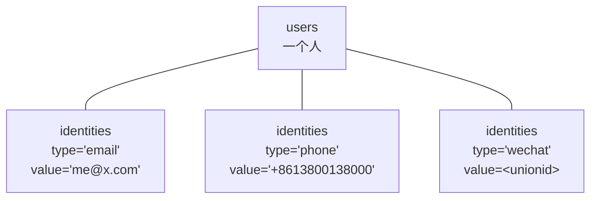
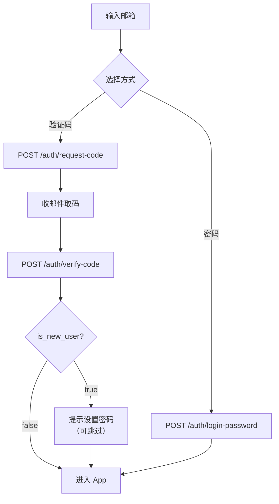

# 登录与鉴权

## 身份模型

一个人（`users`）可以有多种登录方式（`identities`）。



`identities` 表只有一个关键约束：

```sql
UNIQUE (type, value)
```

**这就是邮箱去重的执行点**——由数据库保证，不依赖应用逻辑。同一个邮箱不可能对应两个账号。

### 为什么不用 users.email

早先身份键是 `users.email` 字符串本身，靠 `INSERT ... ON CONFLICT (email)` 做去重。这带来两个无法在原框架内解决的问题：

**其一，同一个人换登录方式就换了一套数据。** 邮箱登录以 `users.email` 为键，Apple 登录以 `(provider, provider_user_id)` 为键，两条路径各自建号、永不合并。同一个人先用 Apple 登一次、再用邮箱登一次，会得到两个账号、两套卡片。

**其二，`email NOT NULL` 逼出了占位数据。** 微信和手机号登录拿不到邮箱，Apple 也未必给真实邮箱。当时的做法是伪造 `apple-<hash>@apple.cardly.local`，把真实邮箱塞进 `primary_email`。每加一个无邮箱的登录方式，就要多一套占位规则。

改成 identities 后：`users` 只存「人」，`users.email` 降级为展示用主邮箱且可空，身份唯一性完全交给 `UNIQUE(type, value)`。

### 两类身份

| 类别 | type | 特征 |
|---|---|---|
| 可验证的联系方式 | `email`、`phone` | 能收验证码，能独立作为登录入口 |
| 第三方身份 | `apple`、`wechat`、`google` | value 存 provider 的 sub/openid，必须跳转授权 |

**手机号与邮箱是平级的**，不是「邮箱账号绑个手机号」。这个设计让未来加手机号只需要：一个 `type` 取值 + 一个短信 sender 实现，**表结构和 find-or-create 逻辑都不用动**。

### Apple 是例外

Apple 登录**仍走老路**：`account_connections` 表 + 占位邮箱，没有迁移到 identities。

这是有意留下的技术债——当时库里 Apple 用户数为 0，迁移它只有成本没有收益。代价是：Apple 用户与邮箱用户仍然分属两个账号，数据不互通。

⚠️ 二阶段做微信 / Google 时必须先还这笔债，否则会有第三、第四套并行的身份路径。另外 App Store 审核指南 4.8 规定：**一旦提供微信 / Google 这类第三方登录，就必须同时提供 Sign in with Apple**，届时 Apple 会重新变成必需项。

### find-or-create

所有 provider 共用 `auth.FindOrCreateUser`（`internal/auth/identity.go`），必须在调用方的事务内执行：

```
按 (type, value) 查 identities
  ├─ 命中 → 更新 last_login_at，返回 isNew=false
  └─ 未命中 → 建 user + 建 identity，返回 isNew=true
```

各 provider 只负责「验证凭据 → 产出 `IdentityRef`」，落库逻辑不重复写。

## 两种登录方式



**验证码是主路径，密码是可选的快捷方式。**

- 验证码**始终可用**，任何账号都能用
- 密码是用户可以后补的便利功能，从没设过密码的账号就是用不了密码登录
- **不区分注册与登录**：验证码验过之后，未知邮箱自动建号

这个设计让注册没有「半成品状态」——不需要 `pending_profile` 之类的中间态，也不需要清理没走完流程的账号。

### is_new_user

`POST /auth/verify-code` 的响应里带 `is_new_user`，客户端据此决定是否引导设置密码。

这是**唯一**能得知「某邮箱是否已注册」的途径，而且必须先持有验证码才能拿到——所以它不构成账号枚举。系统里没有任何未授权可调的「检查邮箱是否存在」接口。

## 验证码

| 参数 | 值 | 常量 |
|---|---|---|
| 位数 | 6 位十进制（可能以 0 开头） | — |
| 有效期 | **10 分钟** | `CodeTTL` |
| 重发冷却 | **60 秒** | `SendCooldown` |
| 尝试上限 | **5 次** | `MaxCodeTries` |

### 三元组

一条验证码由 `(identifier_type, identifier, purpose)` 共同定位：

- `identifier_type`：`email` / `phone`，决定投递通道
- `identifier`：归一化后的邮箱或手机号
- `purpose`：`login` / `delete_account` / `password_reset`

冷却检查与消费查询的 WHERE 都同时带这三列。少了 `identifier_type`，未来的手机号 `+8613800138000` 就可能和某个同名 identifier 撞车。

### 哈希

```
hashValue("email:me@x.com:login:048213")
  = base64url(HMAC-SHA256(AUTH_TOKEN_SECRET, msg))
```

把三元组一起哈希意味着**同一串数字在不同 identifier 或不同 purpose 下哈希不同**。所以登录码无法用于重置密码，反之亦然——即使数字碰巧相同。

### 先投递后落库

```go
if err := s.sender.SendCode(...); err != nil {
    return err        // 失败：不写库
}
// 成功后才 INSERT
```

反过来的话，投递失败时用户**既看到报错、又因为库里已有一条未消费的码而被冷却 60 秒**，只能干等。

### 消费流程

```
1. code 为空 → "code is required"
2. 事务内 SELECT ... FOR UPDATE 取最新一条未消费且未过期的码
3. 查不到 → "verification code is invalid or expired"
4. attempts >= 5 → "verification code attempts exceeded"（此时不再自增）
5. 常量时间比对哈希；不匹配 → attempts+1 并提交，返回同一句"invalid or expired"
6. 匹配 → consumed_at = now()
```

第 5 步用 `subtle.ConstantTimeCompare`，且失败文案与「码不存在」完全相同，不泄露「码对了但过期」这类信息。

⚠️ 冷却只看**未消费**的码。码一旦被成功消费，立刻可以再发新的。

### 投递通道

`newCodeSender` 按顺序短路选择：

| 顺序 | 条件 | 实现 |
|---|---|---|
| 1 | `AUTH_DEV_CODE_LOG=true` | 打日志，**不发信** |
| 2 | `RESEND_API_KEY` 且 `RESEND_FROM` 都有 | Resend HTTP API |
| 3 | `SMTP_HOST` 且 `SMTP_FROM` 都有 | `net/smtp` |
| 4 | 都没有 | 返回 `"email delivery is not configured"` → API 层 501 |

⚠️ **`AUTH_DEV_CODE_LOG` 优先级最高**。生产环境误设它会导致「接口返回成功但用户永远收不到邮件」，且没有任何报错。

### 错误脱敏

上游（Resend / SMTP）的原始错误可能包含 API key、主机名、认证失败详情。这些只写进服务端日志，返回给客户端的统一是：

```
could not send the verification email, please try again
```

这条曾经是真实问题：SMTP 的 `535 Username and Password not accepted` 会原样渲染在登录表单里。

## 会话

**格式**：`cdly_` + base64url(32 随机字节)，共 48 字符。

**存储**：库里只存 `HMAC-SHA256(AUTH_TOKEN_SECRET, token)`，明文不落库。

**有效期**：30 天，**无滑动续期**——到点就得重新登录。

**校验**：一条 SQL 同时检查 token 哈希匹配、未撤销、未过期、用户未软删、`status='active'`。

**登出**：置 `revoked_at`，从不物理删除。

⚠️ 改 `AUTH_TOKEN_SECRET` 会让**所有现存会话立即失效**，因为哈希对不上了。这也意味着轮换密钥 = 强制全员重新登录。

## 密码

| 参数 | 值 |
|---|---|
| 算法 | bcrypt，cost 10（`bcrypt.DefaultCost`） |
| 长度下限 | 8 个**字符**（rune 计数） |
| 长度上限 | 72 **字节**（byte 计数） |
| 失败上限 | 10 次 |
| 锁定时长 | 15 分钟 |

上限 72 字节是 bcrypt 的硬限制——**超出部分会被静默丢弃**。不显式拒绝的话，用户会以为自己设了个很长的密码，实际只有前 72 字节生效。

### 设置密码不要求旧密码

已登录本身就是足够的授权。而且很多用户根本没有旧密码可填（他们是验证码登录进来的）。

### 三重防枚举

**其一，统一错误文案。** 以下三种情况返回**完全相同**的一句话：

- 邮箱不存在
- 密码错误
- 账号存在但从未设过密码

```
invalid email or password
```

**其二，抹平时序差异。** 邮箱不存在时，代码仍然会拿一个硬编码的假哈希跑一次 `bcrypt.CompareHashAndPassword`：

```go
if userID == "" {
    _ = bcrypt.CompareHashAndPassword(
        []byte("$2a$10$N9qo8uLOickgx2ZMRZoMyeIjZAgcfl7p92ldGxad68LJZdL17lhWy"),
        []byte(password))
    return errInvalidCredentials
}
```

不这么做的话，响应时间本身就是一个枚举信道：存在的邮箱要跑 bcrypt（约 50-100ms），不存在的立刻返回。

**其三，重置码对未注册邮箱静默成功。** `POST /auth/password/reset-code` 无论邮箱是否存在都返回 `{"status":"sent"}`，不存在时不发信也不落库。

由于第一条，从没设过密码的用户会卡在「密码不对但不知道为什么」——所以 **iOS 端在这个错误下会补一句「如果你从未设置密码，请改用验证码登录」**。这是客户端补偿服务端的刻意模糊。

### 重置密码会撤销所有会话

重置通常发生在「怀疑账号被盗」时，留着旧会话就失去了意义。

## 鉴权中间件

```go
func (s *Server) requireAuth(next http.Handler) http.Handler {
    // 1. s.auth == nil          → 401 "authentication is not configured"
    // 2. ExtractBearer(header)  → 取 token（前缀比较大小写不敏感）
    // 3. ValidateSession(token) → 查库校验
    // 4. 任何错误               → 401 "unauthorized"（不区分过期/撤销/不存在）
    // 5. 成功 → auth.User 放进 context
}
```

### currentUserID 会 panic

```go
func currentUserID(r *http.Request) string {
    id := currentUser(r).ID
    if id == "" {
        panic("currentUserID called without requireAuth middleware")
    }
    return id
}
```

空 ID 意味着某条数据路由**漏挂了 `requireAuth`**——那会让后续 SQL 失去 `user_id` 过滤，变成跨租户查询。

原来的实现是静默返回空字符串。当时之所以没出事，是因为 `user_id` 列是 UUID 类型，空字符串会在驱动层报错（fail-closed）——**那是运气，不是设计**。现在显式 panic：宁可 500 并留下堆栈，也不让一个无过滤的查询有机会执行。

panic 由 `middleware.Recoverer` 兜住转成 500。这个中间件此前**没有安装**，是随这次改动一起加的——否则 panic 会打挂整个进程。

### 租户隔离

所有数据查询的 WHERE 都带 `user_id = $1`，包括按 ID 直接取单条记录的端点。创建卡片时传入的 `subject_id` 和 `tag_ids` 也会逐个校验归属。

回归测试在 `internal/api/isolation_test.go`：用真实路由，拿 A 的会话去碰 B 的资源，断言拿不到也改不动，并且**验证目标资源事后完好**（只看状态码不够——成功的 DELETE 也返回 200）。

## 三个密钥

| 变量 | 用途 | 约束 |
|---|---|---|
| `AUTH_TOKEN_SECRET` | 会话令牌、验证码、MCP 个人令牌的 HMAC 密钥 | **两个进程必须相同**；缺失则启动失败 |
| `MEMORY_MCP_TOKEN` | 分发给 MCP 客户端的静态 bearer token | 可选 |
| `MEMORY_MCP_OAUTH_TOKEN_SECRET` | OAuth access token 的签名密钥 | 开 OAuth 时必填，且**不能等于**上面两个 |

启动时 `Config.Validate()` 强制校验，不满足直接拒绝启动。

### 为什么必须互不相同

OAuth access token 的 payload 里**明文携带 `user_id`**，校验时只做一次 HMAC 比对：

```json
{"sub":"owner","aud":"...","user_id":"<真实用户ID>","exp":...}
```

如果签名密钥就是 `MEMORY_MCP_TOKEN`——那个要**分发给客户端**的共享 token——那么任何持有它的人都可以自行构造 `{"sub":"owner","user_id":"<任意受害者>"}` 并签名，然后完整读写那个人的数据。

这曾经是真实存在的漏洞：`OAuthTokenSecret` 的默认值就是 `MEMORY_MCP_TOKEN`。

### 曾经的硬编码兜底

API server 的 `AUTH_TOKEN_SECRET` 以前有个默认值 `"development-auth-secret"`，写在源码里。意味着**生产忘配也会静默启动**，并用一个公开在仓库里的密钥签发所有会话令牌与验证码哈希。

现在没有兜底，缺失即启动失败。宁可起不来也不要用一个人人可见的密钥。

## 已知问题

1. **Apple 不走 identities**，与邮箱账号永不合并（见上文）
2. **`mcp_tokens` 没有过期时间**，只能靠手动撤销；且校验时不检查用户是否仍 active（OAuth 路径会检查）
3. `writeAuthError` 里 `errors.Is(err, http.ErrNoCookie)` 是**死代码**——全仓库没有任何地方返回该错误
4. MCP 侧的 Bearer 前缀比较是**大小写敏感**的（`strings.TrimPrefix`），REST 侧不敏感（`ToLower` 后比较）。同一个客户端在两边行为可能不一致
5. 会话没有设备信息，用户无法看到「在哪些设备登录了」，也无法单独踢掉某台设备
