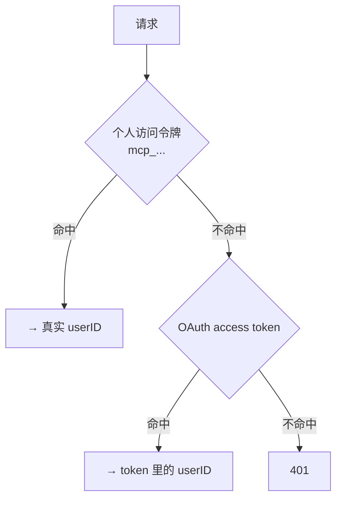
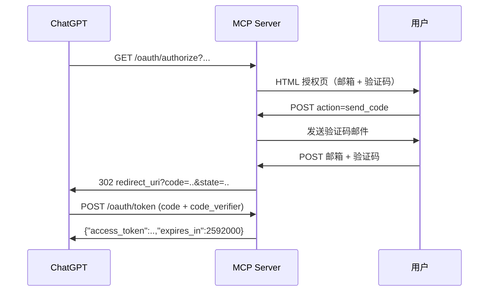

# MCP Server

让 ChatGPT / Claude 这类 AI 客户端直接读写卡片。独立进程 `cmd/mcp-server`，默认端口 3001，与 REST API 共享数据库和 `internal/` 代码。

端点：`/mcp` 与 `/mcp/`。协议走 `modelcontextprotocol/go-sdk`，默认 SSE（`MEMORY_MCP_JSON_RESPONSE=true` 可改成 JSON 响应）。

## 中间件顺序

```
withHostValidation  →  withCORS  →  withAuth  →  MCP handler
```

## 五个工具

### get_subjects_sets

只读，无参数。返回全部科目及其 Set。

```json
{
  "subjects": [{
    "subject_id": "...", "subject_name": "English",
    "card_count": 5, "due_count": 4,
    "sets": [{"set_id": "...", "set_name": "Email", "card_count": 1, "due_count": 1}]
  }]
}
```

实现是 N+1 查询（先查 subjects，再对每个 subject 查一次 sets）。数据量小，暂未优化。

### get_set_cards

只读，按一个明确的 Set 拉取当前用户自己的 active cards。用于在编辑或删除前确认 `card_id`。

```json
{"set_id": "...", "limit": 100}
```

返回：

```json
{
  "set_id": "...",
  "cards": [{
    "card_id": "...",
    "subject_id": "...",
    "set_id": "...",
    "front_text": "有没有可能明天之前拿到？",
    "answer_text": "Is there any chance we could have it by tomorrow?",
    "grammar_phrases": [{"text": "Is there any chance…", "note": "礼貌探询"}],
    "card_type": "sentence",
    "direction": "zh_to_en",
    "created_at": "...",
    "updated_at": "..."
  }]
}
```

不存在或不属于调用者的 Set → `set not found`。`limit` 默认 100，上限 200。

### add_cards

批量创建，**上限 100 张**。

```json
{
  "cards": [{
    "set_id": "...",
    "front_text": "有没有可能明天之前拿到？",
    "answer_text": "Is there any chance we could have it by tomorrow?",
    "grammar_phrases": [{"text": "Is there any chance…", "note": "礼貌探询"}],
    "card_type": "sentence",
    "direction": "ignored"
  }]
}
```

返回：

```json
{
  "created_count": 2, "failed_count": 1,
  "created": [{"index": 0, "card_id": "...", "subject_id": "...", "set_id": "...", "front_text": "...", "answer_text": "..."}],
  "failed":  [{"index": 2, "error": "set not found"}]
}
```

**逐张部分成功**：每张卡独立事务，某张失败不影响其他，失败的记进 `failed[]` 并带上原始数组下标。

`isError` **仅在全部失败时**（`created_count == 0 && failed_count > 0`）为 true。也就是说 100 张里成功 1 张，这次调用就算成功——模型需要自己看 `failed[]`。

⚠️ `direction` 字段的 schema 描述直接写着 `"ignored; direction is derived from front_text"`。后端一律用 `DetectDirection(front_text)` 覆盖。

⚠️ `grammar_phrases` 里 `text` 为空的条目会被静默丢弃。

整体报错（非部分失败）：`cards must contain at least one card`、`cards cannot contain more than 100 cards`。

### edit_card

单卡编辑，**一次只能操作一张卡**。省略的字段保持不变。

```json
{
  "card_id": "...",
  "set_id": "...",
  "front_text": "我只是想确认一下进展。",
  "answer_text": "I just wanted to check on the progress.",
  "grammar_phrases": [{"text": "check on", "note": "询问进展"}],
  "card_type": "sentence"
}
```

返回：

```json
{
  "status": "updated",
  "card": {
    "card_id": "...",
    "subject_id": "...",
    "set_id": "...",
    "front_text": "我只是想确认一下进展。",
    "answer_text": "I just wanted to check on the progress.",
    "grammar_phrases": [{"text": "check on", "note": "询问进展"}],
    "card_type": "sentence",
    "direction": "zh_to_en",
    "created_at": "...",
    "updated_at": "..."
  }
}
```

`grammar_phrases` 若省略则保留原值；传空数组 `[]` 表示清空。修改 `front_text` 或 `answer_text` 后，后端会重新计算 `direction` 和遮盖用的 `answer_tokens`。不存在、不属于调用者、或目标 `set_id` 不属于调用者 → `card not found` / `set not found`。

### delete_card

单卡删除，**一次只能操作一张卡**。

```json
{"card_id": "..."}
```

→ `{"status": "deleted", "card_id": "..."}`

不存在或不属于调用者 → `card not found`。标注了 `DestructiveHint: true`。

⚠️ **接上 MCP 后，模型理论上可以删除你的卡片。** 这是接入前应当知情的。

---

## 两条鉴权路径

`withAuth` 按固定优先级依次尝试：



令牌来源有两处：`Authorization: Bearer <token>` 或 `X-Memory-Mcp-Token` 头。

### 1. 个人访问令牌（推荐）

格式 `mcp_` + base64url(32 字节)，共 47 字符。在 iOS 的 **Me → MCP Access** 生成。

校验时顺带刷新 `last_used_at`，所以 App 里能看到令牌是否还在被使用。

前缀 `mcp_` 用于快速排除（不匹配就不查库）。

### 2. OAuth

ChatGPT 自定义 MCP 应用走这条。见下节。

### 完全未配置时

若 OAuth 与个人令牌解析器都未配置，所有请求返回 401 `server has no authentication configured`。

---

## 会话绑定

这是一个**必须显式实现的安全机制**，不是可选优化。

### 问题

MCP SDK 把 tool handler 拿到的 context 固定成**发起 `initialize` 那次请求**的 context。后续每次请求虽然都过 `withAuth`，但解析出的 userID 会被丢弃——工具实际使用的永远是建立会话时那个人的身份。

后果：知道他人 `Mcp-Session-Id` 的人，只要自己也持有**任意一个合法凭据**通过 `withAuth`，发出的工具调用就会以对方身份执行。

### 解法

```go
var sessionOwners sync.Map // sessionID → userID
```

- **已有会话**（请求带 `Mcp-Session-Id`）：比对本次请求解析出的 userID 与建立会话时记录的是否一致
  - 不一致 → **403** `session does not belong to this credential`
  - 表里查不到 → **404** `unknown session, please reinitialize`
- **新会话**（无 `Mcp-Session-Id`，即 initialize）：绑定

### 为什么绑定要在响应侧记录

`Mcp-Session-Id` 是 SDK 在**响应头**里生成并返回的，initialize 请求本身不带它。

如果只在请求侧检查，时序会是这样：

```
Alice initialize          → 响应 session S，工具绑定 Alice
攻击者用 S 发第一个请求    → 表里还没有 S 的记录 → 抢先记录 S → 攻击者
攻击者后续请求             → 一致，放行 → 但工具仍以 Alice 身份执行
```

所以要用 `sessionCapturingWriter` 包住 `ResponseWriter`，在首次 `WriteHeader` 或 `Write` 时读响应头里的 session id 并绑定。包装类型另外实现了 `Flush()`，否则 SSE 流会失效。

⚠️ `sessionOwners` 是包级全局 `sync.Map`，**永不清理**，进程内单调增长。长时间运行的进程会缓慢积累。

⚠️ 服务重启会丢失整张表，所有现存会话都会拿到 404 并需要重新握手。这是刻意的——无法确认归属时拒绝，好过信任一个来历不明的 session id。

---

## OAuth

仅当 `MEMORY_MCP_OAUTH_ENABLED=true` 时注册。

### 端点

| 路径 | 说明 |
|---|---|
| `/.well-known/oauth-protected-resource` | 资源元数据 |
| `/.well-known/oauth-authorization-server` | 授权服务器元数据 |
| `/.well-known/openid-configuration` | 同上（复用同一 handler） |
| `/oauth/authorize` | GET 渲染授权页，POST 提交 |
| `/oauth/token` | 换取 access token |
| `/oauth/apple/start` · `/oauth/apple/callback` | Apple 登录分支 |

ChatGPT 只需填 MCP 端点 URL，其余靠 `.well-known` 自动发现。

### 流程



授权页支持两种身份验证：邮箱验证码（走与 App 相同的登录逻辑），或 "Continue with Apple"。若 `authService` 未装配，授权页会拒绝登录，不会回落到共享身份。

**参数校验**：`response_type` 必须是 `code`；`client_id` 必须匹配；`redirect_uri` 必须是 **https** 且以 `MEMORY_MCP_OAUTH_ALLOWED_REDIRECT_PREFIXES`（默认 `https://chatgpt.com/connector/oauth/`）开头。

⚠️ **PKCE 非强制**：不传 `code_challenge` 就跳过校验；传了则必须是 S256。

Scope：`recall.cards.read`、`recall.cards.write`。

⚠️ **scope 未被强制**：`ValidAccessToken` 只返回 userID，工具层完全不看 scope。只申请了 read 的令牌照样能调 `add_cards`、`edit_card` 和 `delete_card`。

### Access token 格式

**不是标准 JWT**，是自定义的两段式结构（没有 header 段）：

```
base64url(payloadJSON) + "." + base64url(HMAC-SHA256(secret, base64url(payloadJSON)))
```

payload：

```json
{"sub":"owner","aud":"<publicURL>/mcp","scope":"...","user_id":"<真实用户ID>","iat":...,"exp":...,"jti":"..."}
```

有效期 30 天。

**`user_id` 明文在 payload 里，只靠 HMAC 保证不被篡改**——这就是 OAuth token secret 必须和 App session secret 隔离的原因，见 [auth.md](auth.md#为什么必须隔离)。

校验时若 `authService` 可用，还会调 `UserActive` 确认用户未被软删或停用。

⚠️ **授权码（code）与 Apple state 存在进程内存 map 里**，没有过期清理 goroutine，只在被消费时删除。**服务重启即全部丢失**，进行中的授权流程会失败。

⚠️ 资源元数据里的 `resource_documentation` 指向 `/oauth/docs`，**这个路径没有注册**，访问会 404。

---

## Host 白名单

```go
MEMORY_MCP_ALLOWED_HOSTS  默认 "127.0.0.1,localhost"
```

请求的 `Host` 头不在列表里 → **403 `host not allowed`**。

⚠️ **这是部署最容易踩的坑。** 部署到域名后如果没把域名加进这个列表，所有请求都会 403，而且客户端那边只显示连接失败，没有任何线索指向 Host 校验。

⚠️ 列表为空时**完全不校验**（直接放行）。

⚠️ 去端口的实现是 `strings.LastIndex(host, ":")` 截断，对 IPv6 字面量（`[::1]:3001`）会截成 `[::1]`，对无端口的 IPv6 会误截。

## CORS

与 REST 侧的行为**不同**：

| | REST | MCP |
|---|---|---|
| Allow-Origin | 恒 `*` | 回显请求的 origin |
| 白名单为空时 | — | 全放行 |
| Expose-Headers | 无 | `Mcp-Session-Id`（必须，客户端要读） |

允许的头：`Content-Type, Authorization, Mcp-Session-Id, X-Memory-Mcp-Token`
允许的方法：`GET, POST, DELETE, OPTIONS`

`OPTIONS` 返回 204，**不进入鉴权**。

---

## 环境变量

| 变量 | 默认 | 说明 |
|---|---|---|
| `PORT` | `3001` | |
| `DATABASE_URL` | 本地 Docker | 与 API server 同一个库 |
| `AUTH_TOKEN_SECRET` | **必填** | 必须与 API server 相同 |
| `MEMORY_MCP_ALLOWED_HOSTS` | `127.0.0.1,localhost` | 部署到域名必须加 |
| `MEMORY_MCP_ALLOWED_ORIGINS` | 空（全放行） | |
| `MEMORY_MCP_OAUTH_ENABLED` | `false` | |
| `MEMORY_MCP_OAUTH_TOKEN_SECRET` | 空 | **开 OAuth 时必填，且不能等于 `AUTH_TOKEN_SECRET`** |
| `MEMORY_MCP_PUBLIC_URL` | `http://127.0.0.1:3001` | 用于构造发现文档 |
| `MEMORY_MCP_OAUTH_CLIENT_ID` | `recall-deck-chatgpt` | |
| `MEMORY_MCP_OWNER_PASSWORD` | 空 | 授权页的兜底口令 |
| `MEMORY_MCP_JSON_RESPONSE` | `false` | true 则用 JSON 而非 SSE |

布尔值接受 `1/true/yes/on` 与 `0/false/no/off`，无法识别时回落默认值。

---

## 已知问题

1. **`sessionOwners` 永不清理**，进程内单调增长
2. **OAuth 的 code 与 Apple state 存进程内存**，重启即失，且无过期清理
3. **scope 未被强制**，只读令牌可以执行写操作
4. **`/oauth/authorize` 没有 CSRF 保护**
5. **`mcp_tokens` 无过期时间**，且校验时不检查用户是否仍 active（OAuth 路径会检查）
6. Bearer 前缀比较**大小写敏感**，与 REST 侧不一致
7. `resource_documentation` 指向未注册的路径
8. `get_subjects_sets` 是 N+1 查询
